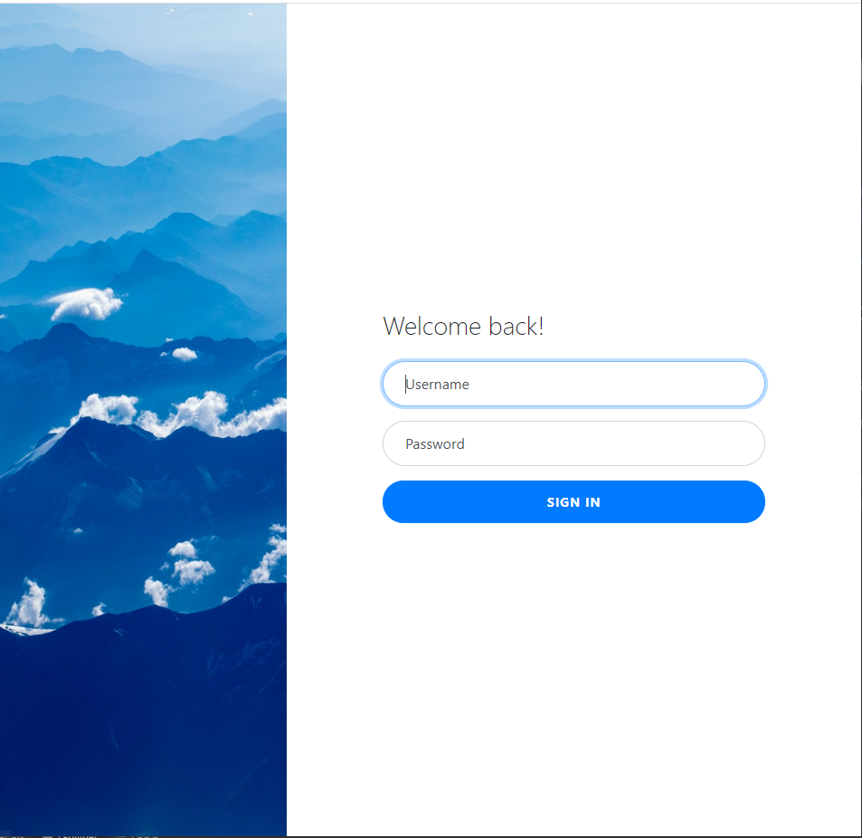
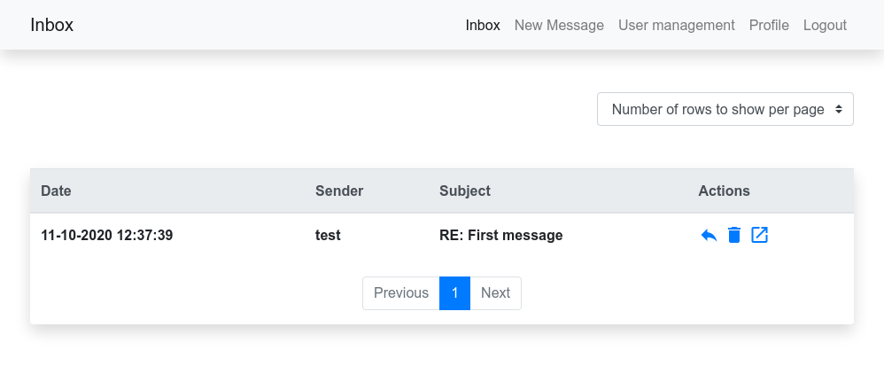
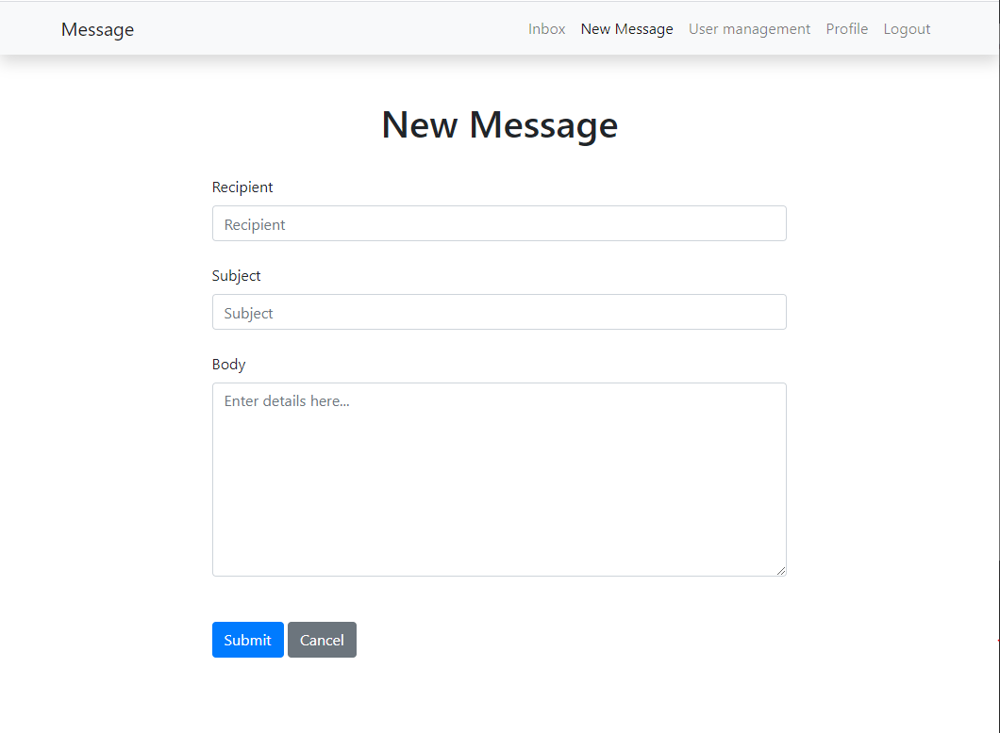
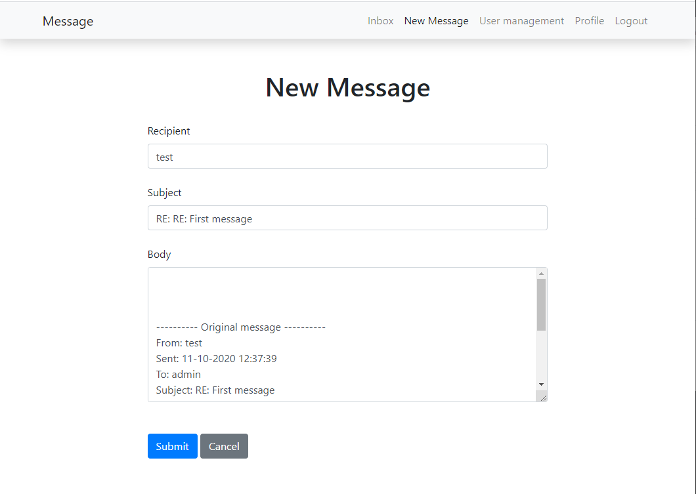
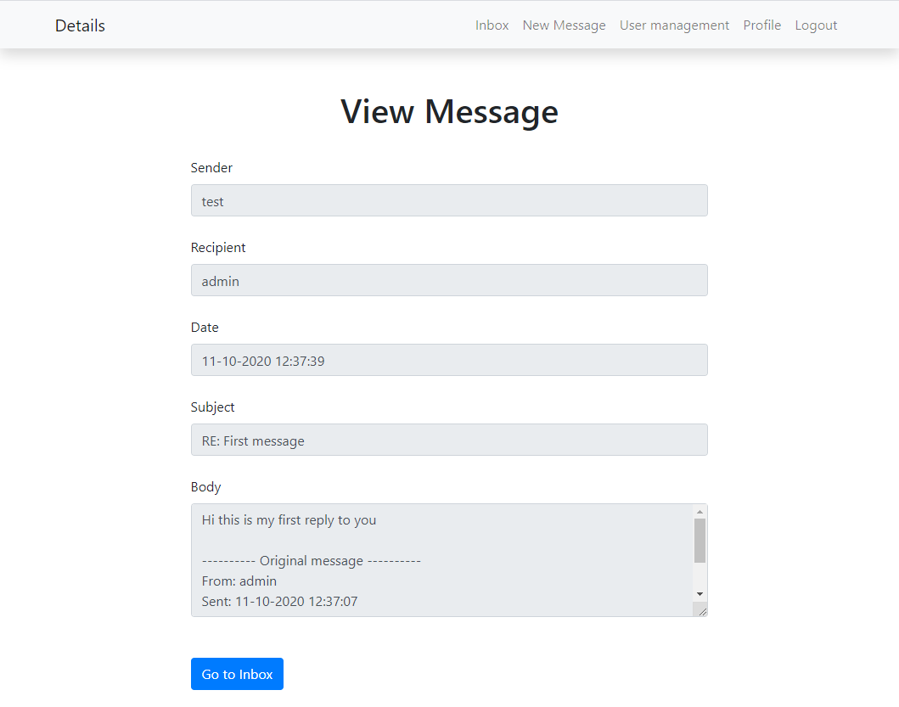
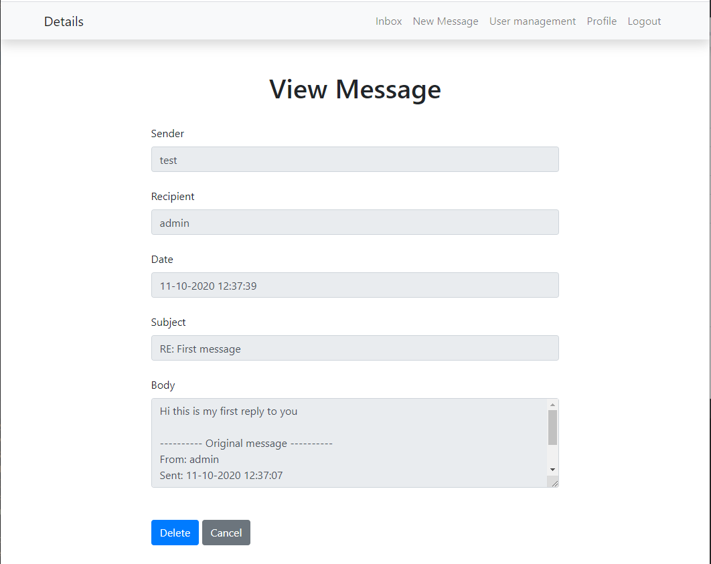
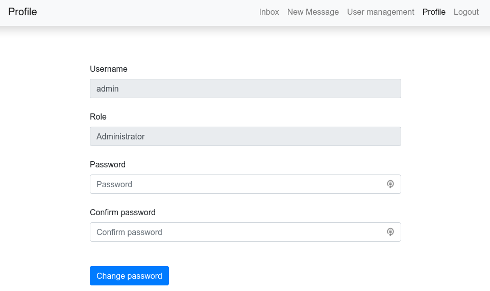
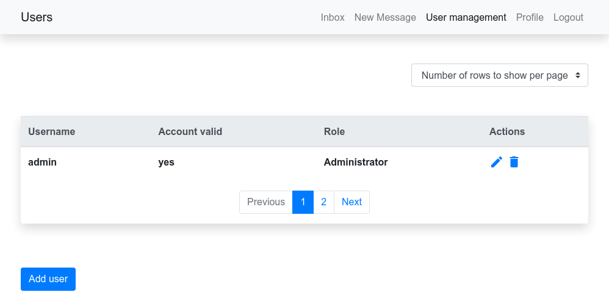
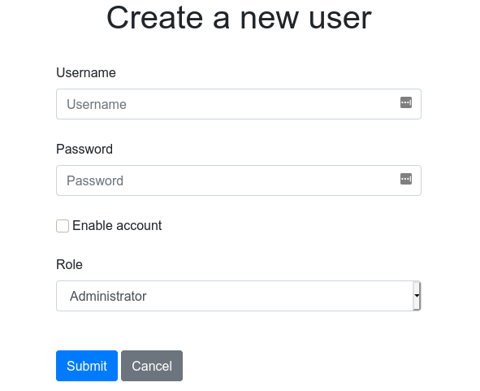
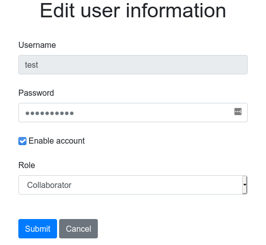

# STI Project 1

## Table of Content
- [Introduction](#Introduction)  
- [Structure of repository](#Structure)
- [Installation](#Installation)
- [Usage](#Usage)

## Introduction

As part of the STI course we were asked to create a website that will simulate a web email system using a database.

In this site you have two different roles, Administrator and Collaborator.  
If you are an Administrator, you will be able to manage the users of the site.

You cannot access the site if you are not logged in. If you try to access other pages you will be redirected to the login page

Here are the available functions once you sign in to the site :

- As a collaborator you can do:
    - See the email sent to you with the following information : the date when the email was sent, the sender and the subject.
    - Next to the information of the email you can choose if you want to delete it, see its details (See more information such as the sender and the body) or reply to it
    - Write a new message by filling a form were you specify the sender the subject and the description.
    - Change your password
- As an Administrator you can do:
    - Same actions as a collaborator
    - Add, delete, update a user.

## Structure

Down below you will find the structure of the repository and an explanation for the folders.

  ```
  images
  site
    databases
    html
        class
        css
        fragments
        message
        user
  Dockerfile
  README.md
  run-dcoker.sh
  ```

The folder `images` will contain the different images for the manual of the application.

The folder `site` is the main folder it contains all the files for the application.

Inside it you will see two folders :

 - `databases` : this is the folder containing the sqlite file that is the database used for the application.
 - `html` : this folder contains all the php files that form the website.

At the root of the folder `html`, you will find the pages that are shown in the navigation bar of the website.

The folder `class`, inside `html`, contains all the classes used on the website.  
The folder `fragments` contains the html content represented in multiple pages for instance in our case the navigation bar.

The folder `message` contains the php pages used to manage a message(view/delete/respond).  
The folder `user` contains all the pages used to manage a user account(add/delete/edit).


## Installation

Here is the explanation on how to install the site :

1. Clone the project using the command git clone :  
  `git clone git@github.com:Naludrag/STIProject.git`

2. Run the script `run-docker.sh`. This script will build a docker image named `sti_project_naludrag` and will run it on the `8080` port of your localhost.

## Usage

### Login Page

This is the first that you will be able to see after the installation.

Here is the result of the page :



This page is pretty simple you have to enter your username password. If your user is not found or your password is incorrect you will have an error message. If not you will see the inbox of your account.


### Inbox page

Once we're logged in, we arrive on the inbox page. This page, displayed below, contains all of the received emails.



For each email, the date it was sent, the sender and the subject are displayed. A user can do the following actions on an email, in the same order as the picture:
- Respond to it
- Delete it
- Show its details


### New message page

This page has two functions the first, as the name suggests, allows the user to create a new message.

Here is the result page :



This pages will ask to fill all the fields for a new message. The new message is sent only if the user indicated exists in the database and that all the fileds are filled. If not the page will show an error and the message will not be sent.

You have two buttons in the bottom of the pages that will allow you to submit the form(send the message) or cancel it and return to the inbox page.

The second function allows a user to answer to an email. In this case the fields will be automatically filled.

Here is an example :


In the body you will find the original messages for the response. The subject will contain the string `RE:` that indicates that this is a response.  
Obviously, if the user want to change the content of the fields he can.

### Message details page

As the previous page this pages will have two functions.

The first function allows the user to view the details of a message.

The form used in the page is similar to the form used in the new message page. This time the sender is shown and the date too.
In this page the fields cannot be changed.

Here is the page :


In this page you will have a button that will allow you to return to the inbox or you can use the navigation bar to go somewhere else.

The second function of the page is that you can view the details of the message before deleting it.  
With that you can verify if you are deleting the rigth message.

Here is the page :


In this mode the page will have two buttons :

 - The cancel button will redirect you to the inbox
 - The delete button that will erase the message from the database

### Profile page
The profile page is used to change the password of the current user, it also displays the username and the role :


### User management page
This page can only be accessed by administrators:  


The page shows all the users in the database and displays the username, the account validity and the role.  
Each user can be edited or deleted.

It is also possible to create a new user with the "Add user" button.

### User creation page
This page can only be accessed by administrators:  


On this page, we can create a new account by specifying the following information:
- Username
- Password
- Whether the account is enabled or not
- Role of the user (Administrator or Collaborator)


### User edition page
This page can only be accessed by administrators:  


On this page, we can edit a user account. It is possible to change the password, account validity and role. The username cannot be changed.
